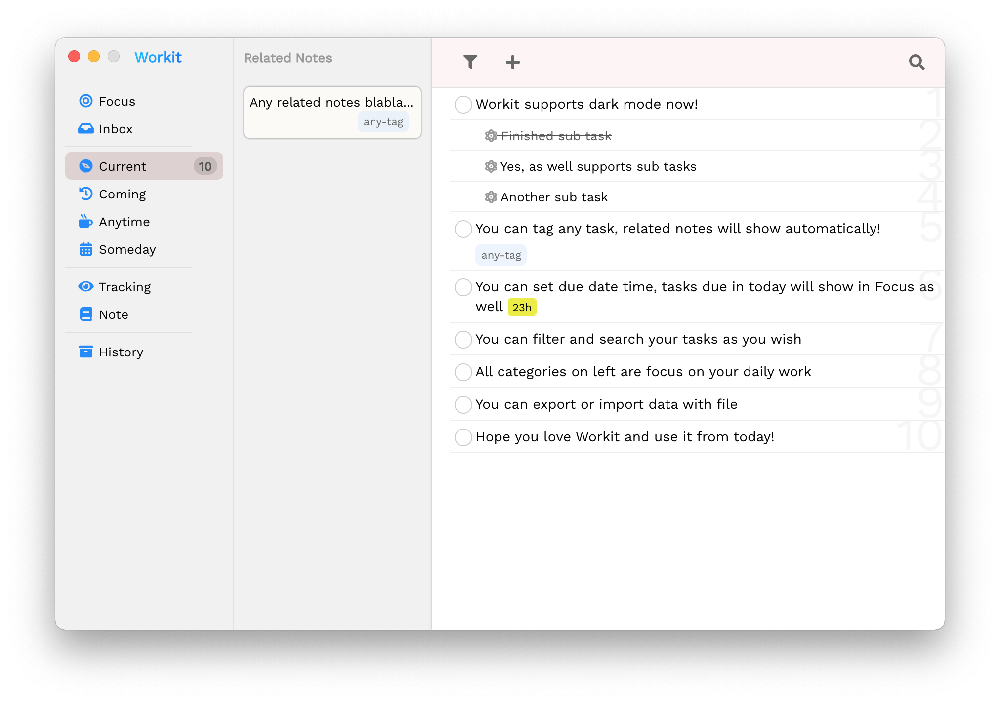
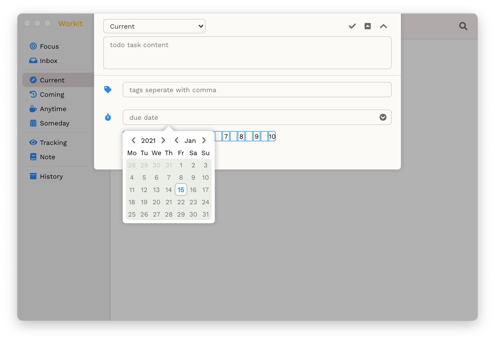
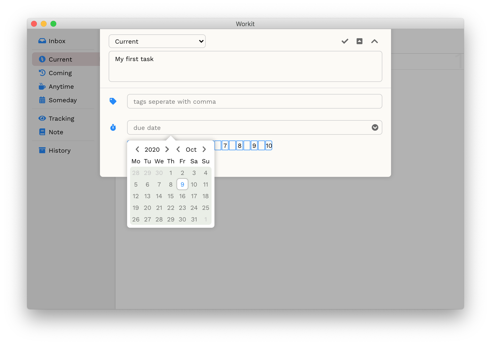

  

# Workit

`Workit` is a todo app focus on daily work tasks.

## Install

```shell
npm install
npm run e:build
```

## Features

* Clean UI design (also follows new MacOS design)
* Categories focused on work
* Show related notes automatically
* Tag your tasks (labels)
* Setting due date to tasks
* Filter tasks
* Search tasks by keyword/label
* Grouping tasks
* Sorting by groups
* Import/Export your data






## Data Storage

### `workitSaveData`

Workit使用源生的LS作为数据存储方式，存储在`workitSaveData`下面，内容为list的完整JSON字符串，结构如下：

```javascript
{
  inbox: [
    // {
    //   content: '测试内容',
    //   cat: 'inbox',
    //   status: 0, // 0 - init, 1 - done
    //   labels: ['分类', '测试'],
    //   group: 1563168778668, // 分组，以时间戳作为唯一key匹配
    //   createTime: 1563168778668,
    //   updateTime: 1563168778668,
    //   dueTime: 1563168778668,
    //   doneTime: null,
    // }
  ],
  current: [],
  coming: [],
  anytime: [],
  someday: [],
  tracking: [],
  note: [],
  history: []
}
```

### `usedTags`

记录用户最近使用过的标签，例如

```javascript
['标签1', 'home']
```

### `lastTimeUsedTags`

记录用户最后一次使用的标签，例如

```javascript
'标签1,home'
```

### `backupHistory`

另外，已清空的全量历史数据，存储在`backupHistory`下面，用于撤销操作或者手动找回历史数据。结构同上结构中的history

## Shortcuts

Workit支持3类快捷键

* Command/Ctrl + A
  * 快速添加待办项
* Command/Ctrl + Shift + A
  * 添加待办项并且直接展开额外配置信息
* Command/Ctrl + Up/Down
  * 快速在左侧导航切换目录

## Operation Abort

Workit支持3种场景下的撤销操作

* Finish完结某个待办项
* 单独Delete删除某个待办项
* 清空所有历史待办项数据

以下就各种场景实现撤销功能的技术方案细节做具体解释：

### 撤销单个操作

撤销单个操作的基础在于记录操作的具体细节，包括

* `operation` - 操作类型，必选，'finish' | 'delete'
* `sourceCat` - 源分类
* `sourceIndex` - 源位置索引
* `targetCat` - 目标分类
* `targetIndex` - 目标索引
* `dataValue` - 数据记录

该方案理论上支持所有类型的单操作撤销，举例说明一下上述支持的实际场景：

Finish完结某个待办项，记录的数据可能是
```javascript
{
  operation: 'finish',
  sourceCat: 'current',
  sourceIndex: 3,
  targetCat: 'history',
  targetIndex: 28,
  dataValue: '' // 可选，此时无必要使用
}
```
此时执行撤销操作，则根据记录的数据进行数据逆向恢复，即把history中第29项数据抽出，重新插回current的第4项位置

单独Delete删除某个待办项，记录的数据可能是
```javascript
{
  operation: 'delete',
  sourceCat: 'anytime',
  sourceIndex: 6,
  targetCat: '', // 可选，此时无实际意义
  targetIndex: -1, // 可选，此时无实际意义
  dataValue: {...}
}
```
此时执行撤销操作，则根据记录的数据进行数据逆向恢复，即把dataValue中暂存的数据重新插回anytime的第7项位置

### 撤销清空所有历史待办项数据操作

撤销清空所有历史待办项数据操作因为数据量大，所以技术方案跟单操作不一样。当用户执行了清空操作时，所有的历史数据本质上会从app中迁移到底层缓存数据中暂存，使用LS的`backupHistory`来存储。当用户执行撤销时，则从缓存数据全量恢复，并清除缓存

> 此方案理论上也可支持后续手动找回已清空的历史数据