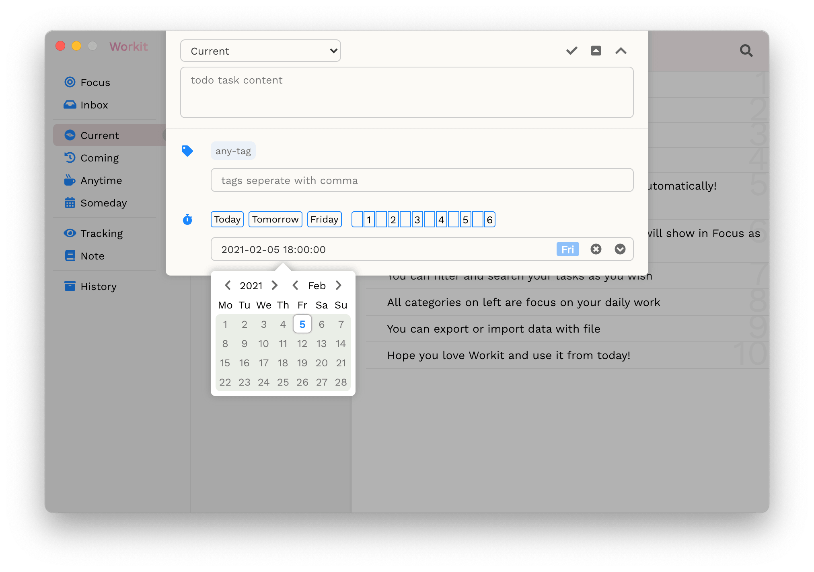

  

# Workit

`Workit` is a todo app focus on daily work tasks.

## Install

```shell
npm install
npm run e:build
```

## Features

* Tag your tasks (labels)
* Smart content detect and analysis(supports labels, due date, repeat type)
* Setting due date to tasks
* Sub Tasks
* Repeatable Tasks
* Filter tasks
* Search tasks by keyword/label
* Show related notes automatically
* Categories focused on work
* Import/Export your data
* Auto history tasks clear
* Auto saving
* Shortcuts
* Choose your own config
* Clean UI design (follows new MacOS design)
* Dark mode support


**see compare detail in [demo](https://youngbeen.github.io/index/index.html#/workitcompare)*



## Shortcuts

`Workit` now supports 3 types shortcuts

* <kbd>Command/Ctrl</kbd> + <kbd>N</kbd>
  * New task
* <kbd>Command/Ctrl</kbd> + <kbd>Shift</kbd> + <kbd>N</kbd>
  * New task in swift
* <kbd>Command/Ctrl</kbd> + <kbd>Up/Down</kbd>
  * Toggle in left navigations

## Smart Content Analyse

You may think editing task in seperated area from content area is a bit of difficult. There's another way to achive it. `Workit` supports smart content detect and analyse, which means you can achive below same goals via input content. (No matter the position in content is)

### Fast labels tagging by `##`

When you input something in `##` pair, the content inside will be fixed into labels and automatically be merged into current labels. e.g.

```string
Task content blahblah...#tag1,tag-2#
```

### Fast due date setting/postpone by `~~`

When you input something in `~~` pair, the content inside will be fixed into due date and current task due date will be set automatically.

Numbers are treated as post days after today. e.g.

```string
# Task due date will be set as today 6pm
Task content blahblah...~0~

# Task due date will be set as next workday 6pm
Task content blahblah...~1~
```

Weekdays are supported as well. e.g.

```string
# Task due date will be set as the target day 6pm
Task content blahblah...~mo~
Task content blahblah...~Mo~
Task content blahblah...~Monday~
Task content blahblah...~星期三~
Task content blahblah...~星期4~
Task content blahblah...~星期日~
Task content blahblah...~星期天~
Task content blahblah...~周日~
```

Date format is supported as well. e.g.

```string
# Task due date will be set as the target day 6pm
Task content blahblah...~03-23~
Task content blahblah...~2021-03-23~
```

### Fast repeat task setting by `^^`

When you input something in `^^` pair, the content inside will be fixed into repeat type and current task repeat type will be set automatically. e.g.

```string
Task content blahblah...^mo^
Task content blahblah...^everymo^
Task content blahblah...^Monday^
Task content blahblah...^星期三^
Task content blahblah...^每星期4^
Task content blahblah...^每个周日^
Task content blahblah...^ew^
Task content blahblah...^每个工作日^
Task content blahblah...^once^
```

### Fast priority setting by `!!`

**This feature is a plan, not deployed yet.**

### Fast key person echo by `@@`

**This feature is a plan, not deployed yet.**

## LS Data Storage

### `workitSaveData`

Workit使用源生的LS作为数据存储方式，存储在`workitSaveData`下面，内容为list的完整JSON字符串，结构如下：

```javascript
[
  // {
  //   index: 0, // 原始索引
  //   content: '测试内容',
  //   cat: 'inbox',
  //   status: 0, // 0 - init, 1 - done
  //   labels: ['分类', '测试'],
  //   group: 1563168778668, // 分组，以时间戳作为唯一key匹配
  //   createTime: 1563168778668, // 因为创建时间是唯一的，可充当id
  //   updateTime: 1563168778668,
  //   dueTime: 1563168778668,
  //   doneTime: null,
  //   parentId: null, // 使用createTime作为id
  //   repeatType: '', // 任务重复类型，具体解释参考下面
  // }
]
```

### `usedTags`

记录用户最近使用过的标签，例如

```javascript
['标签1', 'home']
```

### `lastTimeUsedTags`

记录用户最后一次使用的标签，例如

```javascript
'标签1,home'
```

### `backupHistory`

另外，已清空的全量历史数据，存储在`backupHistory`下面，用于撤销操作或者手动找回历史数据。结构同上结构中的history

## SS Data Storage

### `taskSnapshot`

记录操作之前所有数据的快照信息，结构同`workitSaveData`。用于撤销操作

## NOTES

### `repeatType`类型解释

支持以下取值

* '' - 单次任务
* 'everyWorkday' - 每个工作日
* 'everyMonday' ~ 'everySunday' - 每个星期一~天

## Operation Abort

Workit目前支持3种场景下的撤销操作

* Finish完结待办项
* Delete删除待办项
* 清空所有历史待办项数据

以下就各种场景实现撤销功能的技术方案细节做具体解释：

### 撤销单操作

撤销单操作的基础在于记录操作之前的数据快照信息，这样不管执行何种操作，可方便地恢复到操作之前

### 撤销清空所有历史待办项数据操作

撤销清空所有历史待办项数据操作因为数据量大，所以技术方案跟单操作不一样。当用户执行了清空操作时，所有的历史数据本质上会从app中迁移到底层缓存数据中暂存，使用LS的`backupHistory`来存储。当用户执行撤销时，则从缓存数据全量恢复，并清除缓存

> 此方案理论上也可支持后续手动找回已清空的历史数据